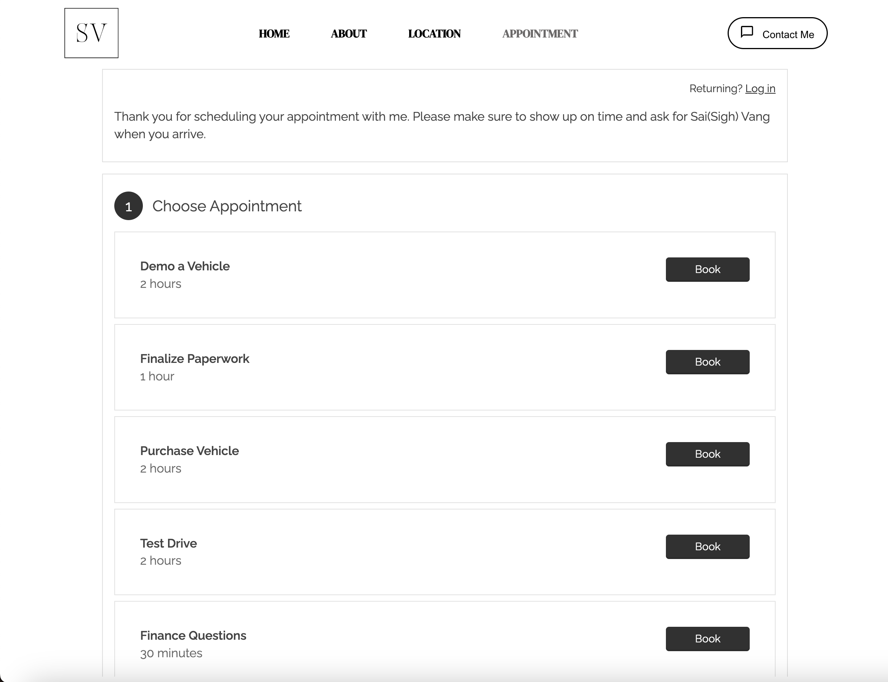

# Client Website
<table>
<tr>
<td>
  The client website serves as a comprehensive platform enabling seamless communication between users and customers. It facilitates appointment scheduling with the client, provides access to the client's location, and offers insights into the client's history. This integrated approach enhances user experience, fostering efficient interaction and engagement with the client's services.
</td>
</tr>
</table>

## Demo
Here is a working live demo :  https://client-website.onrender.com/

## Site

### Landing Page

### Location

### Appointment

### Contact 

### Bug / Feature Request

If you find a bug (the website couldn't handle the query and / or gave undesired results), kindly open an issue [here](https://github.com/mouakiang/client-website/issues/new) by including your search query and the expected result.

If you'd like to request a new function, feel free to do so by opening an issue [here](https://github.com/mouakiang/client-website/issues/new). Please include sample queries and their corresponding results.

## Built with 

- [JavaScript](https://www.w3schools.com/js/) - JavaScript is the world's most popular programming language, it's the programming language of the Web and is easy to learn.
- [Google Maps API](https://www.w3schools.com/graphics/google_maps_intro.asp) 
- [React](https://www.w3schools.com/react/default.asp) - JavaScript library for building user interfaces.
- [CSS](https://www.w3schools.com/css/default.asp) - The language that's used to style an HTML document or if using JSX used to style JSX components.
- [JSX](https://www.w3schools.com/react/react_jsx.asp) - Allows us to write HTML in react.
- [Acuity Scheduling](https://www.acuityscheduling.com/?utm_campaign=acuity&utm_medium=referral&utm_source=scheduling) - Flexibility to schedule appointments, block out dates and choose what you want for appointment creating.
- [EmailJS](https://www.emailjs.com/docs/examples/reactjs/) - EmailJS allows emails to be sent from your contact form to your email.

## Team

 | 

~ [Kia Moua ](https://github.com/mouakiang) | [Greg Topscher](https://github.com/cozyfestiv) ~

## [License]

MIT © [Kiang Moua | Gregory Topscher ](https://github.com/mouakiang | https://github.com/cozyfestiv)

